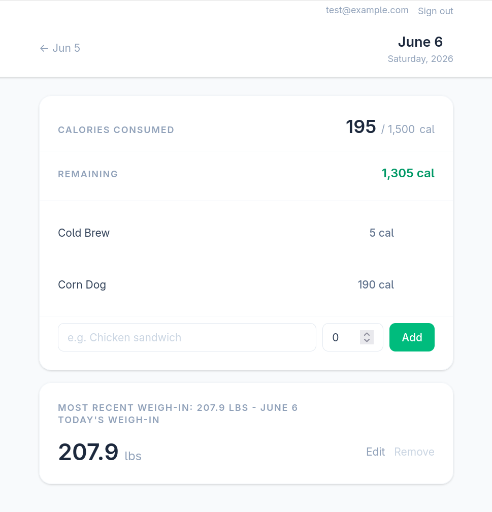

# Weight Tracker
A personal tracking app for logging daily calorie intake and weight.
The app intends to:
- First, and foremost, be a _personal_ project. I use this app myself and intend for its featureset to serve my wants/desires _above all else_.
- Easily track calorie intake and weight changes over time
- Be simple, private, and easy to self-host

Built with [Ruby on Rails][rails] and [Hotwire][hotwire] for a fast, [SPA-like][spa] experience
without the complexity of a separate frontend framework.

## Disclaimer
This software is a personal data collection tool ONLY. It is not a medical or health advice tool, is not intended to diagnose, treat, or prevent any condition, and should not be used as a substitute for professional medical advice. Always consult a qualified healthcare provider before making changes to your diet or health routine.

## Features
- **Daily Food Entry:** Log meals by name and calorie count, and easily browse by day
- **Calorie Tracking:** See calories consumed vs. your configurable daily goal 
- **Weight Tracking:** Record your weigh-ins on whatever schedule you like, and track progress over time
- **Data Visualizations\*:** View personalized data based on your daily inputs
  - *Note: This feature is currently quite simple. I plan to expand upon it in future updates

## Tech Stack
- [Ruby][ruby] & [Ruby on Rails][rails]. See `.ruby-version` and `Gemfile.lock` for current versions. This project aims to stay on the bleeding-edge
- [Hotwire][hotwire] (Turbo + Stimulus) for interactivity and SPA-like experience
- [TailwindCSS][tailwind] for styling
- [Sqlite][sqlite] as a simple database engine

## App Screenshots

## Setup & Installation
### Prerequisites for a Docker-Based Deployment (Recommended)
- [Git][git]
- [Docker][docker]
- (Optional) [Docker Compose][docker-compose]

### Installation Steps
1. `git clone git@github.com:Kmagameguy/weight-tracker.git`
1. `cd weight-tracker`
1. `docker compose up -d`

This will build a new docker image, set up the database, and automatically run the puma webserver in production mode.
Your application will be available at `http://localhost:11232` by default and your SQLite database will be persisted in a `rails_storage` volume by default.
You can change any of these settings to your liking by altering the included `docker-compose.yml` file in the project's root directory.

## Development Setup
### Prerequisites
- [Git][git]
- [Ruby][ruby] (see `.ruby-version` for minimum version)
- [Bundler][bundler]
- [Sqlite][sqlite]
- (Optional) A Ruby version manager, such as [rbenv][rbenv] (recommended)

### Installation
1. `git clone git@github.com:Kmagameguy/weight-tracker.git`
1. `cd weight-tracker`
1. `bundle install`
1. `bin/rails db:setup`
1. `bin/dev`

The app will be available at `http://localhost:3000`

### Creating an Account
Visit `http://localhost:3000` and use the **Sign Up** link/page to create a personal account. Each user's data is fully isolated.

*Note: Email integration (e.g. smtp) is not functional at this time. You'll have to manually manage user data*

### Running Tests
Just run the included `bin/test` convenience script. This will run the entire test suite. The test suite uses Minitest with the Spec-style DSL.

### Project Structure
The app is organized around a few simple resources:
- **DaysController:** This is the primary view, which renders a full day's food and weight data via a `DayPresenter` object
- **FoodEntriesController:** CRUD for food entries, responds with Turbo Streams to manage inline updates
- **WeightEntriesController:** CRUD for weight entries on the Day page
- **PofilesController:** Personal dashboard/stats page for the signed-in user

## Roadmap
Items below represent desired features. They are listed in no specific order, and without specific promises towards their development.
- [ ] Pre-built docker image via ghcr
- [ ] Improve bare-metal production deployment configuration
- [ ] Configurable `weight` units (currently only Imperial pounds [lbs] supported)
- [ ] Additional chart & trend visualizations for weight & calories over time
- [ ] [Hotwire Native][hotwire-native]-based mobile apps

## License
This project is licensed under the GNU GPLv3. See [LICENSE.md](LICENSE.md) for more details.

## Contributing
Contributions are welcome. There's no formal policy in place yet, so if you're interested please try to follow this process:
1. Open a new issue with your feedback/suggestion
1. If you receive a thumbs-up, feel free to open a pull request
1. If approved, I'll merge the changes

If I don't feel like your request fits the project, for one reason or another, you're free to fork the project and maintain the feature inside your own fork.
The project is licensed with the GNU GPLv3 license, after all.

### AI Contribution Policy
This project has a _soft_ stance against contributions aided by generative AI. Basically, if you open a pull request I should NOT be able to tell that the PR description, commits, or code were aided (partially, or in full) by a generative AI Model.  Be sure you fully understand the code changes in your pull request before you open it. Otherwise, your PR will be rejected outright - regardless of how "good" the generated code may be. I deal with enough AI bullshit in my day job and I'd like to avoid encountering it in my personal projects.

[rails]:https://rubyonrails.org/
[hotwire]:https://hotwired.dev/
[spa]:https://en.wikipedia.org/wiki/Single-page_application
[ruby]:https://www.ruby-lang.org/en/
[tailwind]:https://tailwindcss.com/
[sqlite]:https://sqlite.org/index.html
[git]:https://git-scm.com/
[docker]:https://www.docker.com/
[docker-compose]:https://docs.docker.com/compose/
[bundler]:https://bundler.io/
[rbenv]:https://rbenv.org/
[mise]:https://mise.jdx.dev/installing-mise.html
[hotwire-native]:https://native.hotwired.dev/
